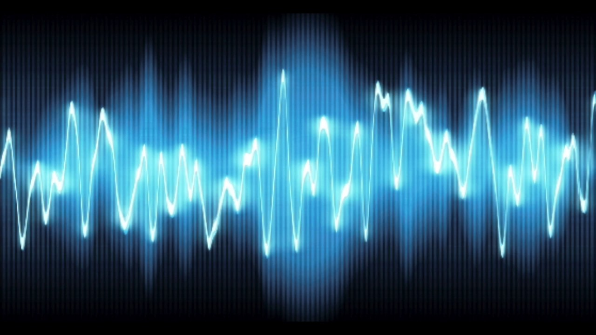

# WaveGAN (PyTorch)

This is my own implementation of WaveGAN using PyTorch, introduced in [this paper](https://arxiv.org/pdf/1802.04208.pdf). The main task was to synthesize a raw audio of drum sounds and human voice articulating numbers 0 to 9.

# Results

✿ Take a look at an example of a synthesized audio [HERE](https://soundcloud.com/lucrece-summer/1-2-3-4-by-wavegan)!✿

# Training Notes

* While building the model, I chose hyperparameters suggested by the paper, EXCEPT the model size (d) :

* **I reduced the model size (d) from 64 (suggested in the paper) to 32, and obtained recognizabel synthesis as early as Epoch 30.**

* During training, I did not use any quantitative stopping criteria (as in the paper). I just used qualitative method of checking the synthesized audio.

# Datasets

WaveGAN model was trained on the following datasets (containing **.wav** files): 

- [Speech Commands Zero through Nine (SC09)](http://deepyeti.ucsd.edu/cdonahue/wavegan/data/sc09.tar.gz)
- [Drum sound effects](http://deepyeti.ucsd.edu/cdonahue/wavegan/data/drums.tar.gz)
- [Bach piano performances](http://deepyeti.ucsd.edu/cdonahue/wavegan/data/mancini_piano.tar.gz)

# Sources

* https://github.com/chrisdonahue/wavegan/
* https://github.com/jtcramer/wavegan/
